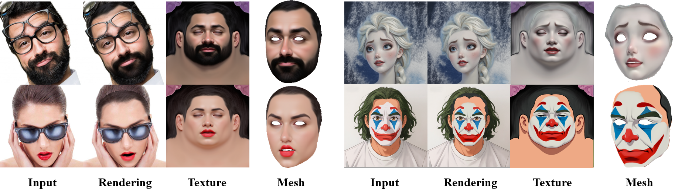

 

  <h1 align="center"><strong>OMGTex: One-stage Multi-style Facial Texture Reconstruction without Geometry Guidance</strong></h1>
  <h3 align="center">🔥 CVPR 2026 🔥 </h3>
  

    <a href="https://github.com/XZT24" target="_blank">Zitong Xiao</a>1*&emsp;
    <a href="https://www.semanticscholar.org/author/Yuda-Qiu/51152863" target="_blank">Yuda Qiu</a>1*&emsp;
    <a href="https://www.linkedin.com/in/yezisheng/" target="_blank">Zisheng Ye</a>1&emsp;
    <a href="https://dblp.org/pid/60/8294" target="_blank">Xiaoguang Han</a>1,2
     
    1SSE, CUHK-Shenzhen&nbsp;&nbsp;
    2Fnii, CUHK-Shenzhen&nbsp;&nbsp;
    *Equal Contribution
  

  

---

## 🔥 News
- **[2026-02]** Our paper was accepted by CVPR2026 ! 🥳
- **[2026-04]** Our paper was released on Github. Arxiv version is coming soon. 
- **[TBD]** Codes and ckpt will be released. Stay tuned.

---

## ⭐ Overview
**OMGTex** is an end-to-end diffusion-based framework for reconstructing high-quality and editable facial UV textures from multi-style facial images.
Existing texture reconstruction methods face two major limitations: 

**(1)** Fragility due to reliance on 3D geometry priors, which are difficult to estimate accurately, especially under facial occlusions or in stylized domains; 

**(2)** A lack of semantic disentanglement, inhibiting region-specific texture editing and style transfer. Our work addresses both challenges simultaneously.

Our core innovation is a geometry-free pipeline that directly maps a 2D face image to its corresponding editable UV texture. We introduce two key techniques: 

**First**, to address the challenge of UV misalignment common in diffusion generation, we introduce a gradient-guided refinement strategy at inference time, which explicitly corrects structural consistency. 

**Second**, we leverage the inherent semantic distribution capability of diffusion models and design a novel training paradigm to enhance this tendency, enabling semantic-aware editing of facial texture. 

**Furthermore**, to address the data scarcity in multi-style texture reconstruction, we construct CANVAS, the first comprehensive paired texture reconstruction dataset covering realistic and diverse stylized domains.
   
---

## 📖 Framework
Coming soon...

---

## 📝 TODO
- \[x\] Release the github page.
- \[x\] Release the paper.
- \[ \] Release the code and pretrained ckpt.

---

## 📚 Getting Started
Coming soon...

---

## 📬 Contact
If you have questions about the paper, feel free to open an issue or contact:
- **Zitong Xiao**: `120090766@link.cuhk.edu.cn`

---

## 🔗 Citation
Coming soon...

